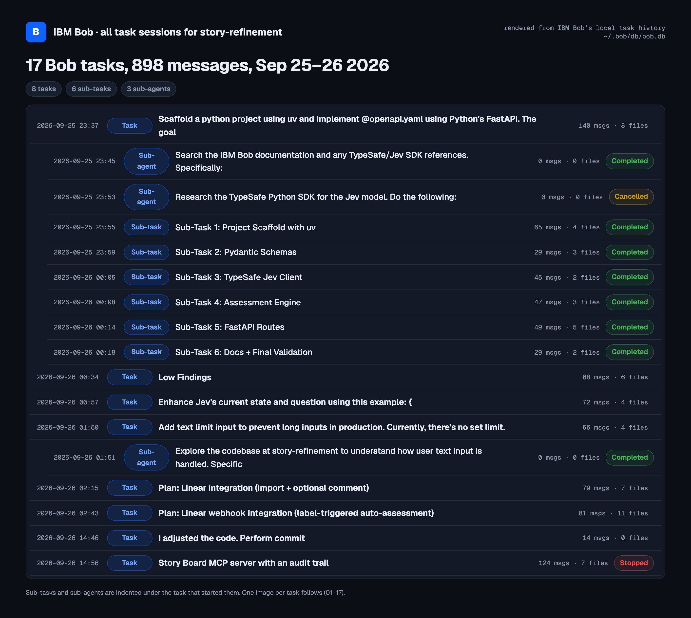

# IBM Bob task sessions

Summaries of the 17 IBM Bob tasks behind this API: 8 tasks, 6 sub-tasks and 3 sub-agents, 898 messages, 25–26 September 2026.

The images are rendered from Bob's local task history (`~/.bob/db/bob.db`), not screenshots of Bob's UI. The text on each is Bob's own:

- **Sub-tasks:** the summary Bob wrote when it closed the sub-task (`end_subtask`).
- **Tasks:** Bob's closing message.
- **Sub-agents:** the result the sub-agent returned to its parent task.

The file lists come from Bob's `write_file`, `apply_diff`, `insert_content` and `search_and_replace` calls. Absolute paths are shortened to repo-relative.

[](00-overview.png)

| # | Started | Type | Task | Messages | Files | Result |
|---|---|---|---|---|---|---|
| [01](01-scaffold-a-python-project-using-uv-and-implement.png) | 2026-09-25 23:37 | Task | Scaffold a python project using uv and Implement @openapi.yaml using Python's FastAPI. The | 140 | 8 |  |
| [02](02-search-the-ibm-bob-documentation-and-any-typesaf.png) | 2026-09-25 23:45 | Sub-agent | Search the IBM Bob documentation and any TypeSafe/Jev SDK references. Specifically: | 0 | 0 | Completed |
| [03](03-research-the-typesafe-python-sdk-for-the-jev-mod.png) | 2026-09-25 23:53 | Sub-agent | Research the TypeSafe Python SDK for the Jev model. Do the following: | 0 | 0 | Cancelled |
| [04](04-project-scaffold-with-uv.png) | 2026-09-25 23:55 | Sub-task | Sub-Task 1: Project Scaffold with uv | 65 | 4 | Completed |
| [05](05-pydantic-schemas.png) | 2026-09-25 23:59 | Sub-task | Sub-Task 2: Pydantic Schemas | 29 | 3 | Completed |
| [06](06-typesafe-jev-client.png) | 2026-09-26 00:05 | Sub-task | Sub-Task 3: TypeSafe Jev Client | 45 | 2 | Completed |
| [07](07-assessment-engine.png) | 2026-09-26 00:08 | Sub-task | Sub-Task 4: Assessment Engine | 47 | 3 | Completed |
| [08](08-fastapi-routes.png) | 2026-09-26 00:14 | Sub-task | Sub-Task 5: FastAPI Routes | 49 | 5 | Completed |
| [09](09-docs-final-validation.png) | 2026-09-26 00:18 | Sub-task | Sub-Task 6: Docs + Final Validation | 29 | 2 | Completed |
| [10](10-low-findings.png) | 2026-09-26 00:34 | Task | Low Findings | 68 | 6 |  |
| [11](11-enhance-jev-s-current-state-and-question-using-t.png) | 2026-09-26 00:57 | Task | Enhance Jev's current state and question using this example: { | 72 | 4 |  |
| [12](12-add-text-limit-input-to-prevent-long-inputs-in-p.png) | 2026-09-26 01:50 | Task | Add text limit input to prevent long inputs in production. Currently, there's no set limit | 56 | 4 |  |
| [13](13-explore-the-codebase-at-story-refinement-to-unde.png) | 2026-09-26 01:51 | Sub-agent | Explore the codebase at story-refinement to understand how user text input is handled. Spe | 0 | 0 | Completed |
| [14](14-plan-linear-integration-import-optional-comment.png) | 2026-09-26 02:15 | Task | Plan: Linear integration (import + optional comment) | 79 | 7 |  |
| [15](15-plan-linear-webhook-integration-label-triggered-.png) | 2026-09-26 02:43 | Task | Plan: Linear webhook integration (label-triggered auto-assessment) | 81 | 11 |  |
| [16](16-i-adjusted-the-code-perform-commit.png) | 2026-09-26 14:46 | Task | I adjusted the code. Perform commit | 14 | 0 |  |
| [17](17-story-board-mcp-server-with-an-audit-trail.png) | 2026-09-26 14:56 | Task | Story Board MCP server with an audit trail | 124 | 7 | Stopped (budget exceeded) |

Task 17 (the MCP server) stopped when Bob's budget of 40 Bobcoins ran out. By then it had written `src/app/mcp_server.py` with its tools and the store, schema, route and `openapi.yaml` changes. It hadn't finished the README update, the tests or the board UI parts; its last todo list on the card shows which items were done.

## Source files

| File | What it is |
|---|---|
| [`tasks.json`](tasks.json) | The data every image is rendered from, one entry per Bob task: request, times, message count, the summary text and where it came from (`summary_source`), the last todo list, the files Bob wrote or edited, the commands it ran, and any error. |
| [`extract.py`](extract.py) | Reads `~/.bob/db/bob.db` (read-only) and writes `tasks.json`. Uses only the Python standard library. |
| [`render.mjs`](render.mjs) | Renders `00-overview.png` and one PNG per task from `tasks.json`, into this folder. |

To regenerate on a machine that has the Bob history:

```bash
python3 docs/bob-sessions/extract.py
npm i playwright marked && npx playwright install chromium   # once, anywhere Node can resolve them
node docs/bob-sessions/render.mjs
```

Set `GEIST_FONTS_DIR` to a folder with the Geist `.woff2` files to use the same typeface as the images here; otherwise system fonts are used.
